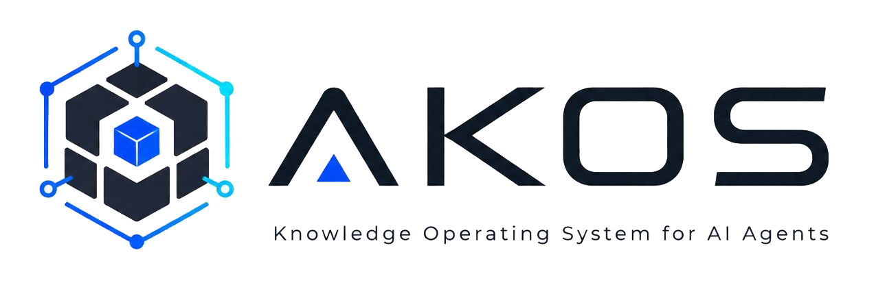
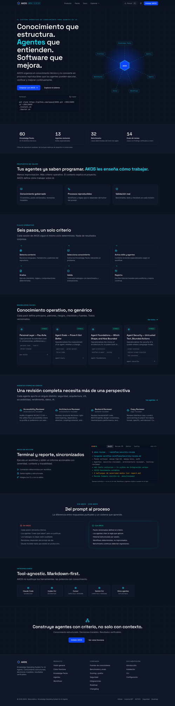
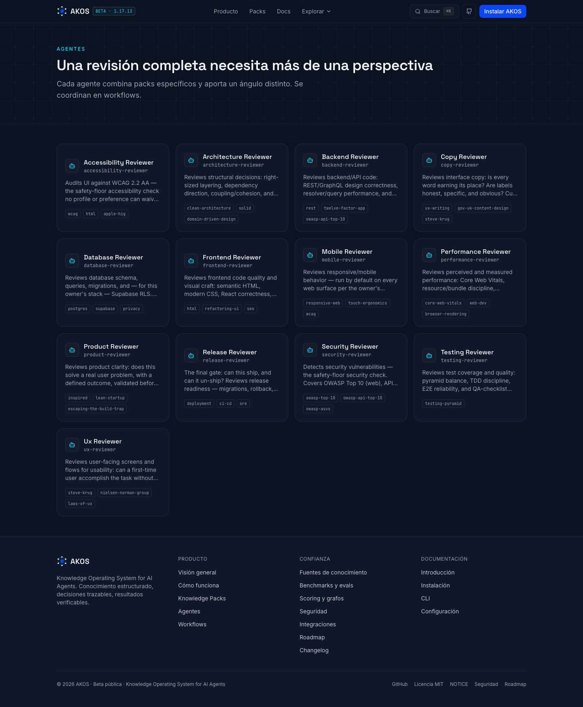

<p align="center">
  
</p>

# AKOS — AI Knowledge Operating System

AKOS helps a solo developer using Claude Code or Codex turn a plausible code
change into an evidence-backed build or review: the agent loads the right
standards, checks the repository, ranks concrete findings and says whether the
work can ship. AKOS lives once on your machine and plugs into every project.

AKOS is **not** a prompt collection, a notes folder, or a pile of book summaries. It is a reusable knowledge system: distilled principles, heuristics, engineering rules, checklists, decision frameworks, anti-patterns, review pipelines, and scoring rubrics — written in original wording, never copied from source material.

## Who it is for

The primary user is a solo developer who already works in Claude Code or Codex
and wants one repeatable job done: run a trustworthy repository or frontend
review without rebuilding the checklist in every session. Teams and other
agents can use the same Markdown, but they are not the activation baseline.

## Why it exists

AI coding agents write plausible code but make junior decisions: unclear navigation, inaccessible forms, leaky auth, feature-factory product thinking. The knowledge to prevent that exists in books, standards, and industry practice — but agents can't use knowledge they can't read. AKOS distills that knowledge into files agents *can* read, with an authority model so they know which source wins when advice conflicts.

## How it works

1. **Knowledge packs** (`packs/`) distill one source or domain each (e.g. `packs/ux/steve-krug/`, `packs/security/owasp-top-10/`). Domain packs share a required-file structure (12 required files, 5 optional); personal packs under `packs/personal/` use a 10-file layout — see [core/knowledge-schema.md](core/knowledge-schema.md).
2. **The core layer** (`core/`) defines how agents reason with the packs: [authority hierarchy](core/authority-model.md), [conflict resolution](core/conflict-resolution.md), [reasoning profiles](core/reasoning-profiles.md) (Prototype → Enterprise), and the [review pipeline](core/review-pipeline.md).
3. **Agents** (`agents/`) are reviewer role definitions — which packs to load, what to check, severity levels, and a unified report format.
4. **Workflows** (`workflows/`) chain agents for concrete tasks: new project, new feature, pre-release review.
5. **Scoring** (`scoring/`) provides 0–100 rubrics per dimension plus an overall score weighted by reasoning profile.
6. **Graphs** (`graphs/`) cross-link concepts across packs so agents can follow ideas between sources.
7. **The `akos` CLI** (`bin/akos`) wires AKOS into any project with marker-based, non-destructive file updates.

## See it

AKOS itself has no UI — it's a CLI plus a Markdown knowledge base your agent
reads. The screenshots below are the companion site
([akos-ai.lovable.app](https://akos-ai.lovable.app)), kept in sync with this
repo's corpus, agents, and roadmap.

<p align="center">
  
  <br><em>Homepage — corpus stats, the six-step pipeline, a real example run.</em>
</p>

<p align="center">
  
  <br><em>The 13 reviewer agents — same names as <code>agents/*.md</code> in this repo.</em>
</p>

## What's in the corpus

60 packs across 12 domains. Each distills one source or domain into the same file
structure, so an agent can fetch exactly the file type it needs without reading the whole
thing.

| Domain | Packs | Covers |
|---|---|---|
| `ux` | 9 | Krug, Norman, NN/g, Laws of UX, Universal Principles, Refactoring UI, WCAG, Apple HIG, Material |
| `architecture` | 7 | Clean Architecture, SOLID, DDD, GoF patterns, Fowler refactoring, Twelve-Factor, module depth |
| `ai-engineering` | 6 | Agent shape, context, coding agents, agent security, evals, tool/MCP design |
| `frontend` | 6 | React, TypeScript, CSS, HTML, design systems, SEO |
| `security` | 6 | OWASP Top 10 / API / ASVS, NIST SSDF, auth flows, privacy and GDPR |
| `devops` | 5 | Deployment, CI/CD, SRE, git, observability |
| `product` | 5 | Inspired, Lean Startup, Continuous Discovery, Build Trap, experimentation |
| `backend` | 4 | Supabase, Postgres, REST, GraphQL |
| `performance` | 4 | Core Web Vitals, web.dev, browser rendering, network |
| `testing` | 4 | TDD, testing pyramid, Playwright, QA checklists |
| `content` | 2 | UX writing, gov.uk content design |
| `mobile` | 2 | Responsive web, touch ergonomics |

Plus `packs/personal/` — your own Level-0 layer, which outranks all of it.

**The corpus is deliberately bounded.** Routing selects 2–5 packs per task from one flat
table, and past roughly 60 rows selection precision degrades faster than coverage improves.
A new pack has to earn its place by displacing one — see the intake gate in
[core/source-policy.md](core/source-policy.md), which also records the candidates that were
evaluated and rejected, with the reason.

## Tool-agnostic by design

The knowledge is plain Markdown; the CLI and lifecycle scripts are Bash, and the validation, rules, benchmark and eval tooling is dependency-free Python (stdlib only). Works with Claude Code, Codex CLI, Cursor, Gemini CLI, Continue, Cline, Roo Code, Windsurf, and any LLM agent that can read files.

## Authority model (short version)

| Level | Source | Wins when |
|-------|--------|-----------|
| 0 | Personal project rules (`packs/personal/`) | Always — unless it violates law, security, or accessibility |
| 1 | Official standards (WCAG, OWASP, NIST, Apple HIG, Material, RFCs) | Over everything below |
| 2 | Industry authorities (NN/g, Krug, Norman, Fowler) | Over books and community |
| 3 | Books & methodologies (Inspired, Lean Startup, Clean Architecture) | Over community |
| 4 | Community knowledge (blogs, repos, forums) | Only when nothing above speaks |

Security and accessibility form a floor that even Level 0 cannot override. Full model: [core/authority-model.md](core/authority-model.md). Conflicts: [core/conflict-resolution.md](core/conflict-resolution.md).

## Reasoning profiles

Reviews adapt to context via profiles: **Prototype**, **Startup MVP**, **Production**, **Enterprise**, **Game Dev**, **Internal Tool**. A prototype skips ceremony but never ships a security leak; production enforces the full pipeline. See [core/reasoning-profiles.md](core/reasoning-profiles.md).

## Prerequisites

**Claude Code or Codex CLI** — or any agent that can read files (see [Use with specific tools](#use-with-specific-tools)). AKOS is knowledge for an agent; without one it does nothing.

**Python 3.10 or newer.** The CLI, schema validation, rules, benchmarks, history, config checking, and the update-safety verifier all depend on it. `install.sh`, `update.sh`, and every operational `akos` subcommand refuse to run — before touching anything — if a valid interpreter can't be resolved; `akos help` and `akos doctor` are the two exceptions (`doctor` is the command that reports Python's absence as a finding). Check yours with `python3 --version`.

macOS ships Python 3.9, which is below the floor. Install a newer one with `brew install python@3.12` or from [python.org](https://www.python.org/downloads/). If you already have a suitable interpreter somewhere else, point AKOS at it instead: `export AKOS_PYTHON_BIN=/path/to/python3`.

## Get your first review

1. Install AKOS globally or as a plugin using one of the paths below.
2. In the project to review, run `akos install-project` when using the global
   clone. A plugin can load its bundled skills directly.
3. **Restart your agent session** — quit and reopen Claude Code, or start a new
   Codex session. Skills are enumerated at session start, so a session that was
   already open when you installed will not see them and will improvise a
   generic review instead of running AKOS.
4. Ask Claude Code or Codex: “Run the full AKOS frontend review on this flow”
   for the five UI lenses, or “Run the full AKOS review” for all twelve.
5. Read the single Review Summary: fix CRITICAL/HIGH items first, then rerun to
   compare the result.

You know it ran: an AKOS review always emits the Review Summary format —
severity-ranked findings with cited evidence, scores or `n/a`, and a final
PASS / PASS WITH FIXES / BLOCKED decision. Prose with no verdict means the
skill did not fire; go back to step 3.

The onboarding target is a first completed review in a median of 10 minutes,
with at least 4 of 5 solo developers succeeding. The baseline is not yet
measured; the [activation baseline](docs/product/activation-baseline.md) defines
the telemetry-free study instead of presenting the target as achieved.

## Install globally

Clone it anywhere — `install.sh` symlinks the canonical `~/DEV/AKOS` path for you:

```bash
git clone https://github.com/ipaud/AKOS.git ~/DEV/AKOS
cd ~/DEV/AKOS
./install.sh      # verifies structure, chmods scripts, symlinks ~/DEV/AKOS + ~/bin/akos,
                  # links the skills into Claude Code and Codex CLI, and links the
                  # 13 reviewer subagents into ~/.claude/agents/ (all akos-prefixed)
./doctor.sh       # health check
```

(Contributors with push access can use the SSH remote instead:
`git@github.com:ipaud/AKOS.git`.)

(If you clone elsewhere, `install.sh` keeps `~/DEV` as-is and creates only the
leaf symlink `~/DEV/AKOS` to the checkout.)

Add `~/bin` to the current shell, then persist it for future terminals:

```bash
export PATH="$HOME/bin:$PATH"
echo 'export PATH="$HOME/bin:$PATH"' >> ~/.zshrc
```

The second line assumes zsh, the macOS default. On bash use `~/.bashrc` or
`~/.bash_profile`; on fish, `~/.config/fish/config.fish`. Writing it to the
wrong file leaves `akos` working in the current terminal and gone in the next.

Reverse the whole install any time with `./uninstall.sh`. It removes only
symlinks whose target proves this checkout owns them, and never touches
`packs/personal/`.

## Integrate into a project

From any project folder:

```bash
akos install-project
```

This creates or updates `CLAUDE.md`, `AGENTS.md`, `.cursor/rules/akos.mdc`, and `.akos/config.md` — appending AKOS sections between `<!-- AKOS:START -->` / `<!-- AKOS:END -->` markers. Existing content is never overwritten; reruns replace only the marked section.

On tools with skills (Claude Code, Codex CLI) the block is four lines — it just marks the project as AKOS-governed and points at `.akos/config.md`. The skills carry the bootstrap and load on demand, so nothing sits in context until it's needed. On Cursor and other rule-file tools the block keeps the full long-form bootstrap.

## Skills

AKOS ships two skills in `skills/`, using the open agent-skills format that **both Claude Code and Codex CLI** read — the same files serve both tools.

| Skill | What it does |
|---|---|
| `akos` | Build mode. Loads the constitution, sets the reasoning profile, loads the Level-0 personal layer, and routes to the 2-5 relevant packs. |
| `akos-review` | Review mode. Runs the twelve-lens pipeline (full or a single targeted lens) and emits the unified Review Summary. |

`./install.sh` links them into `~/.claude/skills/` and `~/.agents/skills/` as symlinks, so edits to your packs are live in both tools immediately. Check with:

```bash
akos list-skills
```

## Use with specific tools

- **Claude Code** — invoke `akos` or `akos-review`; both also fire automatically when the task matches. `akos install-project` marks the project and sets the profile.
- **Codex CLI** — same two skills via `~/.agents/skills/`. `/skills` lists them; `$akos` invokes explicitly. Details in `templates/codex-instructions.md`.
- **Cursor** — `akos install-project` creates `.cursor/rules/akos.mdc` (always-on rule with the full bootstrap; Cursor has no skills).
- **Gemini CLI** — use `templates/gemini-instructions.md` as `GEMINI.md`.
- **Anything else** — `templates/generic-agent-instructions.md`, or paste `prompts/load-akos.md`.

## Install as a plugin

Instead of cloning, AKOS can be installed as a plugin in either tool:

```bash
# Claude Code
/plugin marketplace add ipaud/AKOS
/plugin install akos@akos

# Codex CLI
codex plugin marketplace add ipaud/AKOS
codex plugin add akos@akos
```

Start a new Codex session after installation so its bundled skills are
available. A plugin install is a **copy** in a cache directory. That is right
for trying AKOS or sharing it; for your own working copy prefer the clone +
`install.sh` symlinks above, so edits to your packs take effect immediately.

## Run a review

Ask your agent, in any project with AKOS installed:

> Run the full AKOS frontend review on the checkout screen.

That fires `akos-review` and runs the five-lens UI workflow: UX,
Accessibility, Mobile/responsive, Copywriting and Frontend quality. Ask for a
targeted “AKOS UX review” to run the UX lens alone. Say “run the full AKOS
review” for all twelve lenses. With no explicit profile, AKOS uses Startup MVP.

On tools without skills, use the prompts in `prompts/` (`run-full-review.md`, `run-ux-review.md`, `run-security-review.md`, `run-architecture-review.md`). Every review agent produces the same report format with severity levels, scores, and a PASS / PASS WITH FIXES / BLOCKED decision.

## Add a new pack

First clear the [source intake gate](core/source-policy.md#source-intake-gate) — it decides
whether the source earns a pack at all. Four questions, answered in the PR: what position
does it hold that yields 10+ checkable rules, what gap does it close (shown by grep rather
than asserted), what authority level and why, and for a paper or a blog, what corroborates
it. **A pack is doctrine, not reference** — an API changelog has no position to distill, and
a Level 4 source may never be a pack's basis.

```bash
akos create-pack ux/my-new-source
```

This scaffolds the required files (optional file-types are added by hand when the source has something distinct to say). Fill it following [core/knowledge-schema.md](core/knowledge-schema.md) and the copyright rules in [core/source-policy.md](core/source-policy.md): distill, never copy; cite by title/author/URL only. `prompts/create-new-pack.md` is a ready prompt to have an agent draft it.

New packs start at `status: draft` — readable, but excluded from automatic routing until
they clear the [draft→stable criterion](core/knowledge-schema.md#draft--stable), which is
built from checks that already run rather than new ones.

## Add personal rules

Edit files under `packs/personal/pau-avila/` (the shipped default profile). They are authority Level 0 — the highest — bounded only by law, security, and accessibility. `update.sh` never touches `packs/personal/`.

Want your own profile instead of forking pau-avila's? `akos profile create <name>` scaffolds a sibling under `packs/personal/`, and `akos profile use <name>` points the current project's `.akos/config.md` at it (`personal_profile:` field — see [`docs/profiles/personal-profiles.md`](docs/profiles/personal-profiles.md)).

## Update safely

```bash
./update.sh    # preserves packs/personal/, prints changed files, verifies at the end
```

`update.sh` backs up `packs/personal/` to `~/.akos-backups/` (with a manifest —
path, mode, sha256, symlink targets) and verifies that backup against the live
source before pulling; aborts if either fails. After the pull, the personal
layer is compared against the pre-update manifest, and any drift — even from a
legitimate upstream commit — triggers a full-tree restore back to the exact
snapshot, not a partial fill. A concurrency lock rejects a second run while one
is in progress, and `update.sh` now actually runs `doctor.sh` as a final gate
instead of only suggesting it: the script only prints "Update complete and
verified" if the backup, pull, personal-layer check, and final `doctor.sh` all
passed — a failure at any step exits non-zero.

**Rolling back.** Releases are git-tagged (`vX.Y.Z`). To return to an earlier
one:

```bash
git checkout v1.16.0 && ./install.sh
```

`git tag -l` lists available versions; `./doctor.sh` reports the running one.

## Quality infrastructure

Beyond the knowledge itself, AKOS validates and tests its own consistency:

```bash
akos validate all              # schema-check packs/agents/workflows (schema_version 1, strict)
akos routing-check             # verify draft packs stay out of the stable routing catalog
akos rules run <project-dir>   # 8 executable checks: RLS, secrets, a11y, migrations...
akos benchmark run             # regression suite for the rules above
akos freshness                 # which packs are due for a re-read
akos list-packs [--all|--status draft]  # stable packs by default; draft/deprecated on request
akos profile create|use <name> # your own Level-0 layer instead of the shipped default
akos history compare <a> <b>   # score/decision deltas across two recorded reviews
```

Guarantees these commands are built to hold, each backed by a test:

- **Install never destroys content.** `install.sh` links the CLI, skills, and
  agents through one classified helper — a real file, directory, or foreign
  symlink at any managed destination is left untouched with a warning; only its
  own or a recognisable prior AKOS install is refreshed.
- **The rule scanner fails closed.** A detector or registry that cannot run is a
  visible error, not a finding, and never a clean exit — an incomplete scan
  cannot report "clean". A realistic credential blocks wherever it lives
  (`tests/`, `docs/`, source); the path never downgrades it.
- **Review history is immutable and atomic.** Records get unique ids and publish
  by atomic rename, so two records in the same second both survive, a published
  review is never overwritten, and a failed record leaves nothing partial;
  readers skip in-flight staging directories and report a corrupt review rather
  than hiding it.
- **AKOS:START/END markers are never guessed at.** A single shared parser
  (`bin/marked_sections.py`) classifies a managed file as absent, present, or
  ambiguous, and refuses to write when ambiguous rather than picking the first
  marker pair it finds. `install-project` preflights all 4 managed files before
  writing any of them.
- **Schema contracts are versioned and strict.** Every pack, agent, and workflow
  declares `schema_version: 1`; an unknown top-level or nested field is a
  validation error, and an unrecognized schema version fails explicitly instead
  of silently validating against whatever the current schema happens to be.
- **A pack's lifecycle status has real teeth.** `status: draft` packs are
  excluded from the automatic routing table and from any stable agent's or
  workflow's dependencies; `akos check-config` flags a project that tries to
  list one in "Packs to always load."
- **Attribution and cross-references are checked, not trusted.** Every pack
  README must carry an independent-distillation line, and every `metadata.yaml`
  `related:` path must resolve — both enforced by `doctor.sh`. The first check
  found a pack that had shipped with no independence claim at all; the second
  covers a field the schema types as plain strings, where a typo silently
  pointed nowhere.

`.akos/config.md` is read as untrusted project data — it can supply hints and
raise scrutiny, never lower the safety floor.

Full docs: [`docs/architecture/`](docs/architecture/) (a dated v1.3.0 baseline + target system), [`docs/contracts/`](docs/contracts/) (pack/agent/workflow schemas), [`docs/rules/`](docs/rules/authoring-rules.md), [`docs/benchmarks/`](docs/benchmarks/overview.md), [`docs/scoring/`](docs/scoring/evidence-confidence-coverage.md), [`docs/product/`](docs/product/activation-baseline.md) (primary job + activation study), [`docs/profiles/`](docs/profiles/personal-profiles.md), [`docs/reviews/`](docs/reviews/history-and-comparison.md), [`docs/maintenance/`](docs/maintenance/freshness.md), [`docs/cli/`](docs/cli/exit-codes.md), [`docs/migration/`](docs/migration/v1.1-to-next.md). Tests: [`tests/README.md`](tests/README.md). CI: `.github/workflows/`.

## Repository layout

```
core/         how agents reason (constitution, authority, profiles, pipeline, scoring model)
packs/        knowledge packs by domain + personal layer(s)
agents/       13 reviewer role definitions
skills/       akos + akos-review (Claude Code and Codex CLI)
workflows/    task-level review flows
templates/    per-tool integration templates
prompts/      ready-to-paste prompts (fallback for tools without skills)
graphs/       concept cross-links between packs
scoring/      0–100 rubrics per dimension
schemas/      Versioned JSON Schema contracts (v1/) + registry.json + the validator + the YAML parser + routing/config checks
rules/        executable checks (Level A/B) — the rules registry + runner
benchmarks/   reproducible regression cases for rules/
tests/        unit (Python unittest) + integration (bash) test suites
docs/         architecture, contracts, rules, benchmarks, scoring, product,
              profiles, reviews, maintenance, cli, and migration documentation
bin/akos      CLI
```

## License and copyright

AKOS is [MIT licensed](LICENSE).

It distills ideas; it does not reproduce sources. No copied paragraphs, no long quotes, no chapter recreations. References cite title, author, organization, and official URL only. Full policy: [core/source-policy.md](core/source-policy.md); how that interacts with the license: [NOTICE.md](NOTICE.md).
